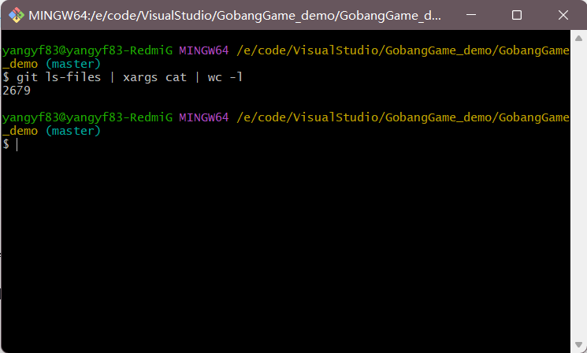

# GobangGame_demo
初级实训五子棋赶鸭子上架版

<align p = "center"> 203030368 杨翼飞 

<align p = "center"> Github:[NorthSecond](https://github.com/NorthSecond/) 

## 简介

使用Qt编写的简单的五子棋应用程序，使用Git进行版本控制和管理。简要实现了人际对战和人机对战功能。

由于代码做了一些稳健性的牺牲和保留了网络接入网络对战的接口，因此代码量相对较大，使用 `git ls-files | xargs cat | wc -l` 命令查看代码行数达到了2679行。

PVE算法主要使用 alpha-beta 剪枝的博弈树 GameTree 来进行实现。但是由于代码优化做的不到位，复杂度做的太高，导致在大棋盘的背景下反应时间过慢，出现阻塞和卡顿情况。后期计划使用 QThread 将机器算法单独成为一个线程，，同时优化代码降低复杂度，提高代码运行效率。
